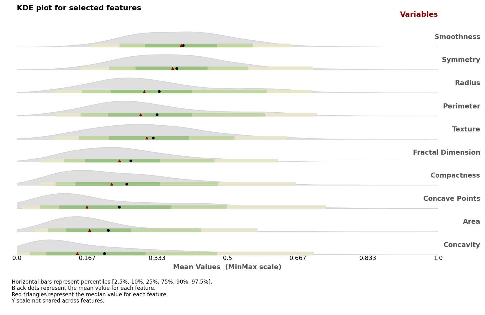
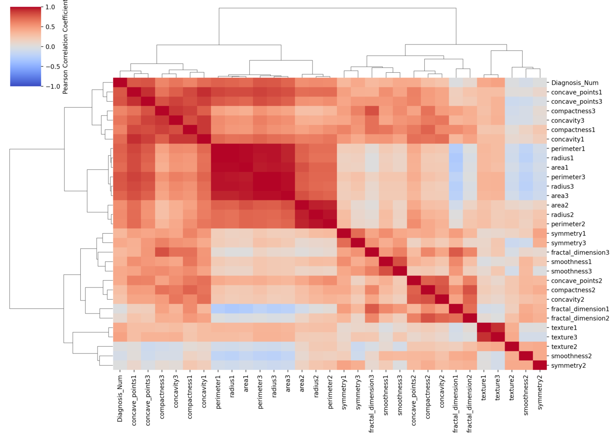
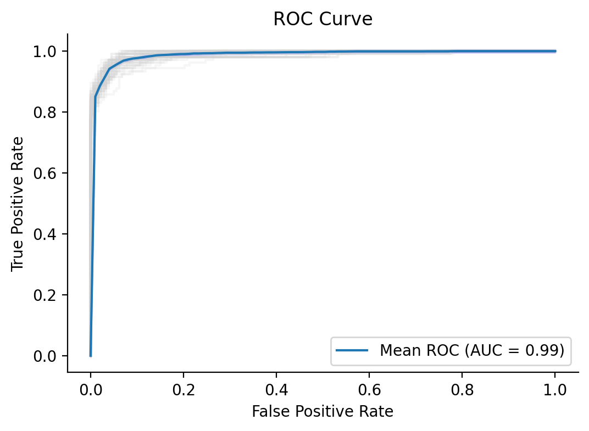

# **Health Data Analysis and Modeling with Streamlit**
CLASS: **INFORM**

***PhD programme HEADS** of **FMUP** in collaboration with **CINTESIS***
## **Objective**

This project demonstrates a comprehensive data science workflow using a health-related dataset. The objectives are:

1. Perform an **Exploratory Data Analysis (EDA)** to gain insights into the dataset.
2. Create **useful visualizations** to highlight patterns, distributions, and relationships.
3. Train and evaluate predictive models to classify diagnoses.
4. Leverage **SQL queries** with **DuckDB** for efficient data manipulation and integration with Python.
5. Build an interactive web application using **Streamlit** to showcase the analysis and results.

## **Key Features**
- **SQL Integration with DuckDB**: Efficient querying and manipulation of data directly from memory.
- **EDA and Visualizations**:
  - Descriptive statistics and distributions.
  - Hierarchical clustering heatmaps for correlations.
  - Interactive visualizations using Seaborn and Plotly.
- **Modeling**:
  - Machine learning models including Logistic Regression, Random Forest, and XGBoost.
  - Evaluation metrics such as AUC, F1-score, Precision, and Recall.
  - Repeated stratified K-fold cross-validation for robust validation.
- **Streamlit App**:
  - A user-friendly interface for navigating through the EDA, feature engineering, and modeling results.

## **Setup Instructions**

### **Prerequisites**
- **Python**: Ensure Python is installed (preferably Python 3.9 or later).
- **Conda**: Install Conda for environment management.

### **Environment Setup**
1. Clone the repository:
   ```bash
   git clone <repository_url>
   cd <repository_folder>
   ```
2. Create the Conda environment:
   ```bash
   conda env create -f python_ds_inform.yaml
   ```
3. Activate the environment:
   ```bash
   conda activate ds_inform
   ```
4. Run the Streamlit app:
   ```bash
   streamlit run breastcancer_app.py
   ```

### **Dependencies**
The environment includes the following key libraries:
- **Streamlit**: For building the web app.
- **DuckDB**: For SQL-based data manipulation.
- **Seaborn** and **Plotly**: For visualizations.
- **Scikit-learn** and **XGBoost**: For modeling and evaluation.

For the full list, refer to [`python_ds_inform.yaml`](./python_ds_inform.yaml).

## **Project Structure**
```
.
├── breastcancer_app.py     # Entry point for the Streamlit app
├── overview.py             # Overview & Details about the project
├── exploratory.py          # EDA visualizations and analysis
├── feat_eng.py             # Feature engineering and transformations
├── models.py               # Model training, evaluation, and comparison
├── tools/
│   ├── data.py             # Centralized data functions using DuckDB
│   ├── viz.py              # Visualization utilities
├── python_ds_inform.yaml   # Conda environment file
└── README.md               # Project documentation
```

## **Application Workflow**

1. **Overview Tab**:
   - A summary of the dataset and its key attributes.

2. **EDA Tab**:
   - **General Description**: Descriptive statistics of the dataset.
   - **Univariate Analysis**: Ridgeline plots, histograms, and QQ plots.
   - **Multivariate Analysis**: Pairwise relationships and scatter plots.
   - **Correlations**: Hierarchical clustering heatmaps.

3. **Feature Engineering Tab**:
   - Generate new features using PCA and outlier detection.

4. **Modeling Tab**:
   - Compare models with original and engineered features.
   - Visualize mean ROC curves and evaluate metrics like AUC, F1, and Precision.

## **Example Visualizations**

### **Ridgeline Plot**
Visualizes the distribution of feature sets like mean values, max values, and standard errors:


### **Hierarchical Correlation Heatmap**
Highlights correlations between features and their clusters:


### **ROC Curve**
Displays the mean ROC curve for each model across all folds:
